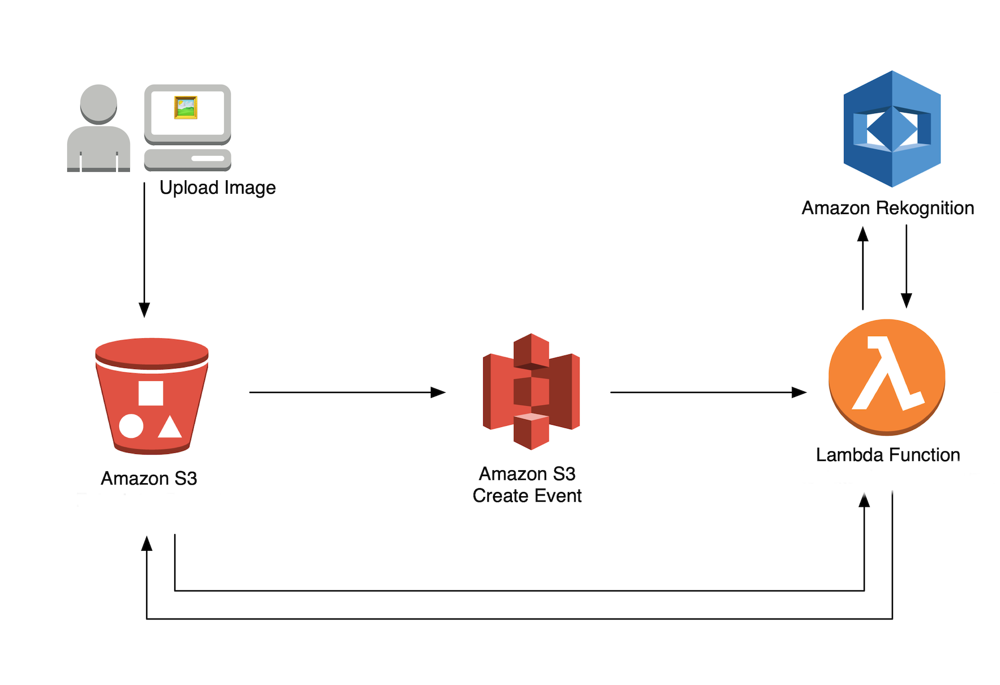

# Image Rekognition
From this challenge: https://github.com/LambdaSharp/Automated-Image-Workflow-Challenge
  
## Problem
We want to provide authenticated users a way to upload images to an S3 bucket. We also want to limit the user's access to this bucket as much as possible. To do this, the client will make an HTTP request to get a temporary URL that gives us access to POST to the S3 bucket. 

### Client

The client is a simple web page that allows users to upload an image to S3. The client will make a request to get a temporary URL. This triggers a lambda which asks S3 to generate a presigned URL that only accepts POST for a limited time. A presigned URL can be valid for a maximum of seven days because the signing key used in the signature calculation is valid for up to seven days. The default is five minutes. The client then uploads the selected file to the URL provided in the first request. 

### Image Rekognition

Once an object is placed in the Image Rekognition bucket, a lambda is triggered. The triggered lambda will take the file and send it to AWS Rekognition for analysis. The output from AWS Rekognition is logged in Cloudwatch.
Supported Rekognition features:
* Detect Labels
* Detect Text
* Recognize Celebrities
